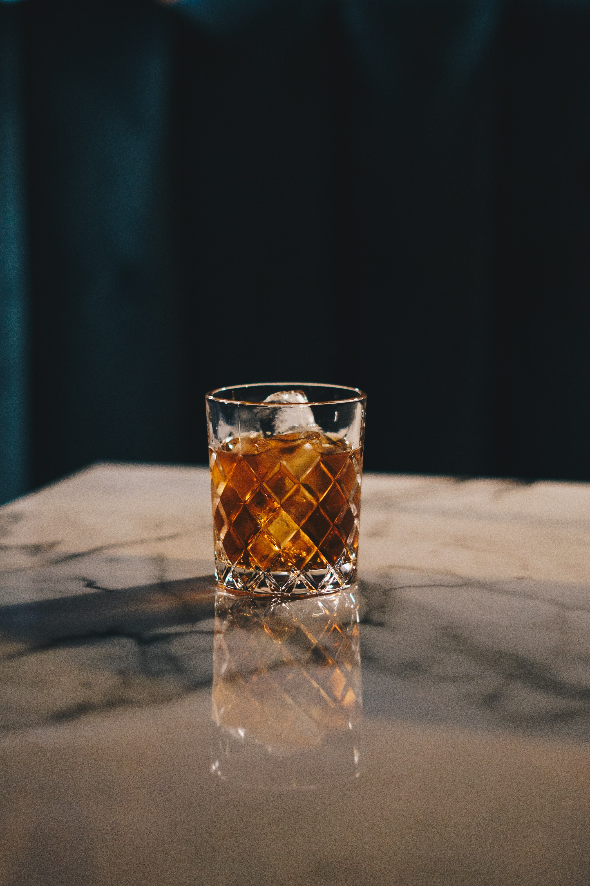

The dawa cocktail hails from 1980s Nairobi, with The Carnivore restaurant claiming to have invented the drink. This cocktail is one of the most beloved alcoholic beverages in Kenya and as a result can be find all across the country!

Fun fact: The dawa cocktail literally translates to the medicine cocktail! Not that it has any real medicinal uses!

## Ingredients

* 1 lime
* 1 tbsp white sugar
* 6 ice cubes
* 60ml vodka
* Honey to taste

## Method

1. Cut the lime into quarters and put them in your glass. 
2. Add the sugar and muddle the mixture with a stick until the sugar is moist. Be careful not to extract too much bitterness from the lime peel by being gentle whilst muddling!
3. Add the ice to the glass. 
4. Pour the vodka over the ice.
5. Dip your stirring stick in honey and then lightly stir it into the drink.

Serves: 1
Preparation time: Less than 5 minutes